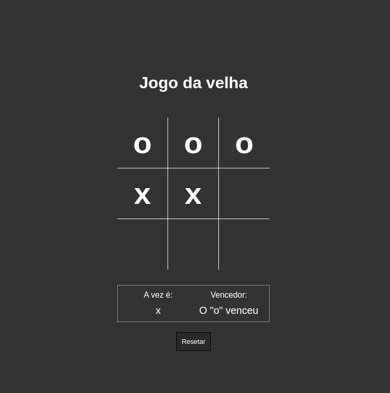

# Jogo da Velha JS

Link do projeto em funcionamento: https://jogo-da-velha.coderosa.tech	



> Bateria em Javascript, usado para treinar habilidades de emitir sons ao clicar em determinadas teclas


### 🟢 Projeto concluído


## 🚀 Instalando Jogo da Velha JS

Para instalar o Jogo da Velha JS, siga estas etapas:

Linux e macOS:

```
git clone https://github.com/TayseRosa/js-drums.git
```

## ☕ Usando Jogo da Velha JS

Para usar Jogo da Velha JS, siga estas etapas:

```
Acessar a pasta jogo-da-velha
Duplo clique em index.html
Testar no seu navegador favorito
```

## 📫 Contribuindo para Jogo da Velha JS

Para contribuir com Jogo da Velha JS, siga estas etapas:

1. Bifurque este repositório.
2. Crie um branch: `git checkout -b <nome_branch>`.
3. Faça suas alterações e confirme-as: `git commit -m '<mensagem_commit>'`
4. Envie para o branch original: `git push origin <nome_do_projeto> / <local>`
5. Crie a solicitação de pull.

Como alternativa, consulte a documentação do GitHub em [como criar uma solicitação pull](https://help.github.com/en/github/collaborating-with-issues-and-pull-requests/creating-a-pull-request).

## 🤝 Colaboradores

Agradecemos às seguintes pessoas que contribuíram para este projeto:

<table>
  <tr>
    <td align="center">
      <a href="https://github.com/TayseRosa" title="Tayse Code Rosa">
        <br>
        <sub>
          <b>Tayse Rosa</b>
        </sub>
      </a>
    </td>
  </tr>
</table>

Copyright :copyright: 2023 · Feito com por ❤️ Tayse Rosa
